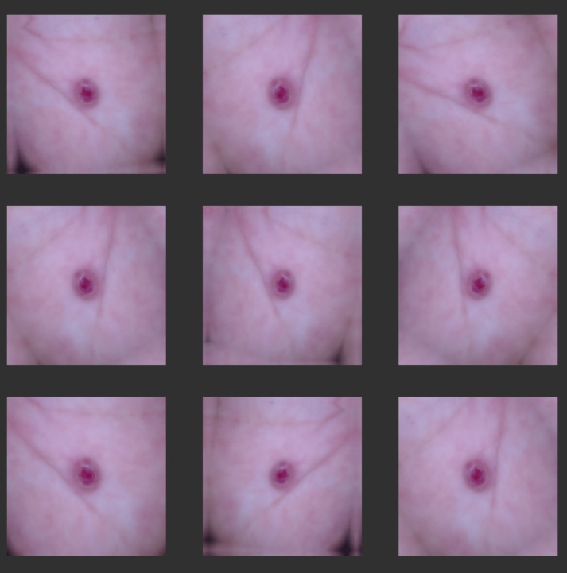

# Skin Cancer Detection using Multiclass Classification CNN Model 
> To build a multiclass CNN based classification model in TensorFlow which can accurately detect melanoma. 
Melanoma is a type of cancer that can be deadly if not detected early. It accounts for 75% of skin cancer deaths. A solution that can evaluate images and alert dermatologists about the presence of melanoma has the potential to reduce a lot of manual effort needed in diagnosis.

## Table of Contents
* [General Information](#general-information)
* [Project Pipeline](#flow-of-the-code)
* [Environment and Tools Used](#technologies-used)
* [Performance Evaluation and Conclusions](#models-performance-evaluation)
* [Acknowledgements](#acknowledgements)

<!-- You can include any other section that is pertinent to your problem -->
## General Information
- Provide general information about your project here.
- What is the background of your project?
- What is the business probem that your project is trying to solve?
- What is the dataset that is being used?

<!-- You don't have to answer all the questions - just the ones relevant to your project. -->
## Project Pipeline
- Data Reading/Data Understanding → Defining the path for train and test images 
- Dataset Creation→ Create train & validation dataset from the train directory with a batch size of 32. Also, make sure you resize your images to 180*180.
- Dataset visualisation → Create a code to visualize one instance of all the nine classes present in the dataset 
- Model Building & training : 
	- Create a CNN model, which can accurately detect 9 classes present in the dataset. While building the model, rescale images to normalize pixel values between (0,1).
	- Choose an appropriate optimiser and loss function for model training
	- Train the model for ~20 epochs
	- Write your findings after the model fit. You must check if there is any evidence of model overfit or underfit.
- Chose an appropriate data augmentation strategy to resolve underfitting/overfitting 
- Model Building & training on the augmented data :
	- Create a CNN model, which can accurately detect 9 classes present in the dataset. While building the model rescale images to normalize pixel values between (0,1).
	- Choose an appropriate optimiser and loss function for model training
	- Train the model for ~20 epochs
	- Write your findings after the model fit, see if the earlier issue is resolved or not?
- Class distribution: Examine the current class distribution in the training dataset 
	- Which class has the least number of samples?
	- Which classes dominate the data in terms of the proportionate number of samples?
- Handling class imbalances: Rectify class imbalances present in the training dataset with Augmentor library.
- Model Building & training on the rectified class imbalance data :
	- Create a CNN model, which can accurately detect 9 classes present in the dataset. While building the model, rescale images to normalize pixel values between (0,1).
	- Choose an appropriate optimiser and loss function for model training
	- Train the model for ~30 epochs
	- Write your findings after the model fit, see if the issues are resolved or not?
 
### Dataset used:
The dataset consists of 2357 images of malignant and benign oncological diseases, which were formed from the International Skin Imaging Collaboration (ISIC). All images were sorted according to the classification taken with ISIC, and all subsets were divided into the same number of images, with the exception of melanomas and moles, whose images are slightly dominant.

The data set contains the following diseases:

- Actinic keratosis
- Basal cell carcinoma
- Dermatofibroma
- Melanoma
- Nevus
- Pigmented benign keratosis
- Seborrheic keratosis
- Squamous cell carcinoma
- Vascular lesion

Observations on class distribution:

- pigmented benign keratosis and melanoma have larger number of images, 462 and 438 respectively
- seborrheic keratosis and dermatofibroma have least number of images, 77 and 95 respectively

So there is a clear class imbalance in the data which is not a good quality for training data. However, let us see how the training goes. If the model is biased or overfitted or underfitted, we might have to do something to correct this imbalance.

### CNN Architecture Design:
To classify skin cancer using skin lesions images wit goal of higher accuracy on the classification task, I have built three custom CNN models wic comprises of following layers/modules:

- Rescalling Layer - To rescale an input in the [0, 255] range to be in the [0, 1] range.
- Convolutional Layer - Convolutional layers apply a convolution operation to the input, passing the result to the next layer. A convolution converts all the pixels in its receptive field into a single value. For example, if you would apply a convolution to an image, you will be decreasing the image size as well as bringing all the information in the field together into a single pixel.
- Max Pooling Layer - Pooling layers are used to reduce the dimensions of the feature maps. Thus, it reduces the number of parameters to learn and the amount of computation performed in the network. The pooling layer summarises the features present in a region of the feature map generated by a convolution layer.
- Dropout Layer - The Dropout layer randomly sets input units to 0 with a frequency of rate at each step during training time, which helps prevent overfitting.
- Flatten Layer - Flattening is converting the data into a 1-dimensional array for inputting it to the next layer. We flatten the output of the convolutional layers to create a single long feature vector. And it is connected to the final classification model, which is called a fully-connected layer.
- Dense Layer - The dense layer is a neural network layer that is connected deeply, which means each neuron in the dense layer receives input from all neurons of its previous layer.
- Activation Function(ReLU) - The rectified linear activation function or ReLU for short is a piecewise linear function that will output the input directly if it is positive, otherwise, it will output zero.The rectified linear activation function overcomes the vanishing gradient problem, allowing models to learn faster and perform better.
- Activation Function(Softmax) - The softmax function is used as the activation function in the output layer of neural network models that predict a multinomial probability distribution. The main advantage of using Softmax is the output probabilities range. The range will 0 to 1, and the sum of all the probabilities will be equal to one.

### CNN Models trained:
#### Model 1 Arcitecture:
This model had following configuration

#### Model 2 Arcitecture:

#### Sample of augmented images added by operations like rotation, flipping etc.

#### Model 3 Arcitecture:
- USed augmentor to add 500 augmented images in each class to overcome overfitting due to class imbalance

#### Model 3b Arcitecture:

## Performance Evaluation and Conclusions:
Observations and learnings from First CNN Model (no dropout, no data augmentation):

- While training accuracy is increasing almost consistently (at first rapidly and then slowly but steadil) from 0.28 to 0.94, validation accuracy is going up in a zig-zag manner but not able to cross 0.47. This clearly indicates that model is an overfit, remembering the training data well but nor performing half that well with unseen data
- The loss graph also narates the same story. For training data, at first it decreses rapidly and then little slowly, from 10.94 to 0.14, which is very impressive. However, validation loss, togh have a decreasing trend, does so in a zig-zag fashion, with minimum loss value at 2.72. -in both the metrics, training data performance is good but on validation data, model is not doing a good job - indicating overfitting
- Hence, first model clearly suffered due to class imbalanced and hence overfitted

How to improve this model?
- overfitting can be due to imbalance in the data which we had anticipated after class distribution visualization.
- we can try and augment the training data in order to balance te class distribution

Observations and learnings from Second CNN Model (no dropout, used data augmentation):

- in this model, I tried to manage data imbalance and overfitting by adding some images which were generated by rotating, flipping original images
- while the above performance graph looks a little bizarre, if we observe carefully and compare it with the previous model, it is definitely an improved model. Let us see why it is a better model:
	- It reduced the gap between training accuracy and validation accuracy hence reducing overfitting. In the previous model training and validation accuracy was 93.75% & 35.35% resp. While in this model it is 74.94% & 53.69% resp. A significant improvement in overfitting issue.
	- In the raph, the validation loss is increasing instead of reducing, however it is still quite less compared to first model. Validation loss in previous model was 6.27 v/s now 1.6, a significant reduction in loss.
- However, this cannot be the best model, there is scope for a lot of improvement as accuracy is clearly not that good. Given this can be a question of life-&-death, we need higher accuracy without overfitting. 

Observations and learnings from Third CNN Model (used dropout, used data augmentation):

Used Augmentor to add 500 augmented images in each class to overcome overfitting problem (due to class imbalance). But did that help?

There is a lot to learn and infer from this model's training performance:
- Training accuracy was increasing almost consistently (except one dip towards the end)
- Validation accuracy, though a little up-&-down, was increasing till epoch 21, after which it was unstable and trend was more downward
- interestingly, epoch 21 had training and validation accuracy quite close to each other at 75% & 77%. At this point model almost overcame the overfitting
- However final training accuracy of 79.86%, though an improvement from the previous model (model2) is still not acceptable. Moreover, final validation accurac is too low (14%) again pointing at overfitting

So what do we do now? How to improve this model?
- low accuracy indicates that we are missing out on some important features. Not using a dropout layer after convolution layer may help in retaining important features.
- but to overcome overfitting we need dropout layer at least between dense layers.
- also use early stopping in case the metric is not improving for a few consecutive epochs

So giving it one more try in order to get better trained model.

- However, it is still possible to improve the model further, one can experiment with following (could not try everting as google colab can be used for limited time):
	- different filter sizes
	- different combination of convolutation layers (check what appens wen we increase / decrease layers, change number of filters in each layers) 
	- different combination of dense layers 
	- use dropout of different % at different stage of layers

This code opened up a lot of possibilities of how a CNN can do fantastic job in classifying something so useful, almost life saving.
With more GPU time in hands, one can definitely get igher accuracy and save man lives.

## Environment and Tools Used
1. Jupyter Notebook with Google Colab
2. Numpy
3. Pandas
4. Scikit-image
5. Matplotlib
6. Scikit-learn
7. Keras

<!-- As the libraries versions keep on changing, it is recommended to mention the version of library used in this project -->

## Acknowledgements
- Thanks to Upgrad Instructors and Live PI Sessions
- Gratitude to Kaggle data sets and Google Colab platform
- Gratitude to Github

## Contact
Created by [@DrParulShah] - feel free to contact me!

<!-- You don't have to include all sections - just the one's relevant to your project -->
